Vanilla Wheels is what makes the pack's vehicles go: the [Trailblazer](/wiki/trailblazer),
the [Trailer](/wiki/trailer) and the [Farmer's Pickup](/wiki/farmers-pickup). It drives them,
fuels them, keeps their chests, repairs them and recovers them, and it adds the **Mechanic
Lift** to build them on, **keys** that are never lost, and **rolling garage doors** to park
them behind.

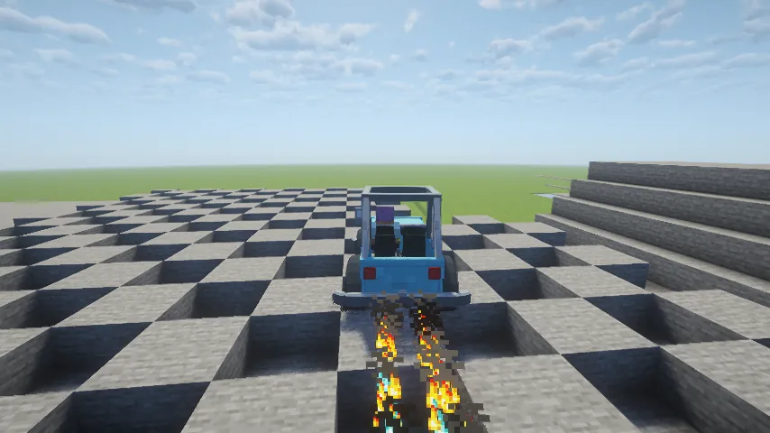

## Driving

- **Get in:** right-click a vehicle. You take the nearest free seat, the driver's first.
  **Crouch** to get out, as from a boat.
- **Drive:** the movement keys. A standing car turns on the spot with the stick held.
- **Horn:** **Left Control**, while you ride (it's still sprint everywhere else).
- **Headlights:** **H** cycles off, on and auto (auto switches them on when it gets dark). The
  mode shows at the lower left beside the hotbar. The lamps light up the road ahead.
- **Climbing:** a vehicle drives up a one-block step without jumping, the way you step up a
  slab. A two-block ledge is a wall: use a ramp.
- In third person the camera stands back in proportion to the vehicle's size.

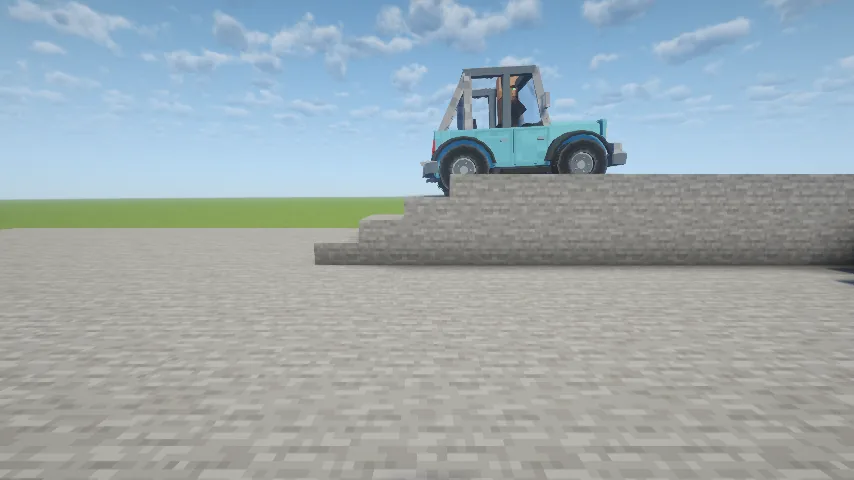

### Drifting and the boost

Hold **jump** while turning above a third of top speed and the car drifts: the nose swings
out, the tyres squeal, steering tightens or widens the slide, and a charge builds. **Let go**
and you get a boost for up to two seconds, faster than top speed, with an afterburner out the
back. The longer the drift, the bigger the boost.

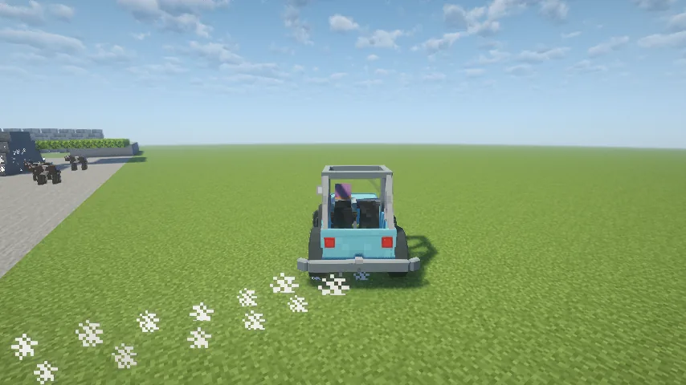

### The dash

The speed and fuel needles on the dashboard really move. From inside, the windshield
is see-through.

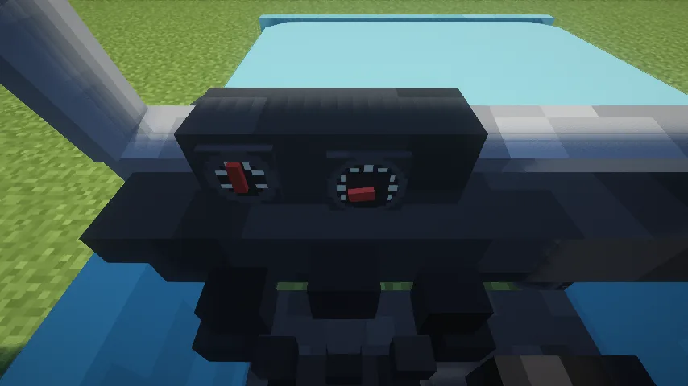

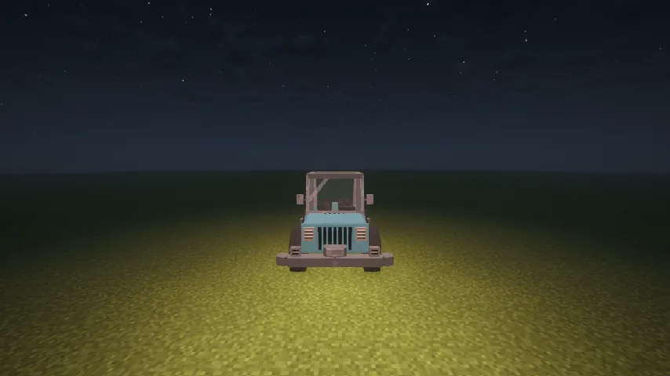

### Crashes, falls and running things over

- **Falls:** the suspension takes the first **seven blocks** of a fall before anyone aboard
  feels it, so a drop of up to ten blocks hurts nobody. Driving off a real cliff still hurts.
- **Running things over:** above a walking pace a vehicle hurts what it hits and knocks it down
  the road, harder the faster you go. A cow slows you more than a chicken.
- **Fragile blocks:** glass, leaves, flowers, saplings and small plants break when you drive
  through them, where you're allowed to build. Stone and other solid blocks are walls.
- **Other vehicles:** bumping one shoves it according to mass and speed.

## Fuel

Vehicles run on **gas cans**.

- **An empty can:** eight iron ingots in the shape of a can (a handle in the top-left over a
  square body).
- **Filling it:** craft the empty can with four coal or charcoal. A full can is a full tank,
  about twenty minutes of throttle.
- **Refuelling:** hold right-click at the vehicle with a full can and it pours, a full tank in
  six seconds. The action bar shows the level. A poured-out can is an empty can again.
- Coal by itself doesn't fuel a vehicle.
- The engine only burns fuel while you're on the throttle: idling and coasting are free. An
  empty tank won't drive. In creative you need no fuel.

## Chests and the radio

- **Chests:** a vehicle's chests are real double chests. Right-click one to open it (crouching
  or not) from anywhere you can aim at it. While riding, press your **inventory key** to open the
  first chest. Whatever's inside stays inside when the vehicle is packed up or wrecked.
- **The radio:** crouch and right-click a vehicle that has one while holding a music disc, and it
  plays for everyone nearby, like a jukebox. Crouch and right-click it empty-handed to take the
  disc out.

## Damage, packing up and repairs

A vehicle has a **condition**. Mobs, arrows, bullets, explosions and fire wear it; your own punches
don't. Each vehicle has a **durability** that divides the damage: a car or truck takes about seven
pistol rounds, four rifle rounds, two shotgun shells or two rockets before it's a wreck, and a
helicopter more. An explosion or a lightning strike counts once.
It shows as a row of ten **wrenches** above your hunger bar, for the vehicle you're riding (and
the trailer it tows) or the one you're looking at. Like hearts, the row blinks when it's hurt
and jiggles when it's low.

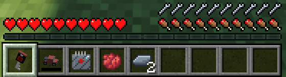

- **Worn to nothing**, a vehicle drops as a packed wreck, with its cargo safe. Its engine won't
  run until it's repaired a bit.
- **Packing up:** punch a vehicle **six times in a row** and it packs into your inventory as it
  is: condition, cargo, fuel, paint, disc, name and key all kept. Stop for more than a second and
  the count starts again. Nobody can pack a vehicle while someone rides it, and a vehicle with a
  key only packs for the key's owner. Place the item to set it down again.
- **Repairing by hand:** right-click a damaged vehicle where you'd climb in. Each click repairs
  2.5% (hold the button to keep going), and once it's whole the same click gets you in. It costs
  **hunger**, not materials:

| Vehicle | A full rebuild costs |
|---|---|
| Trailblazer | 5 food points (2½ drumsticks) |
| Farmer's Pickup | 4.5 food points |
| Trailer | 3 food points |

With an empty hunger bar you're too hungry to work. In creative one click fixes it for free.

## Keys and recall

Craft a **Vehicle Key Fob** from two iron ingots, redstone and an ender pearl, and use the blank
key on a vehicle to pair it: one key per vehicle, as many vehicles as you like. The key is named
for its vehicle and banded in its paint.

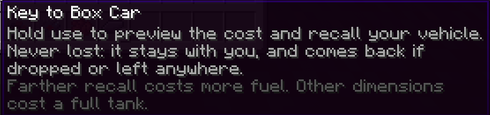

- **A paired key is never lost.** Toss it, drop it when you die, put it in a chest, or let
  someone else pick it up, and it comes back to you: when you respawn, when you log in, or as
  soon as you have room. Only `/clear` or the creative bin can destroy one. To replace a lost
  key, use a blank key in the air.
- **Recall:** hold use with the key to find the vehicle and see what bringing it back costs. Keep
  holding for a second and it comes into your inventory, with the trailer it's towing, all cargo
  and damage kept.

| Distance | Fuel it costs, of a full tank |
|---|---|
| 250 blocks | 1% |
| 1,000 blocks | 5% |
| 2,000 blocks | 20% |
| 4,000 blocks | 80% |
| 4,473 blocks or more, or another dimension | 100% |

If the tank is short, it empties and half the shortfall comes off the condition instead. Recall
won't work with passengers or animals aboard, a chest open, or no room in your inventory, and
then it costs nothing. In creative it's free.

## Building: the Mechanic Lift

A vehicle is built from its parts on a **Mechanic Lift**:

- a **chassis** (each vehicle's own recipe; the item names the vehicle);
- one **wheel** per wheel: eight leather around a steel ingot;
- an **engine**, if it has one: two redstone, a redstone torch, a diamond and five steel.

The lift itself is two pistons, three iron blocks, a redstone block and three smooth stone.
Steel comes from [Metals and Materials](/wiki/metals-and-materials).

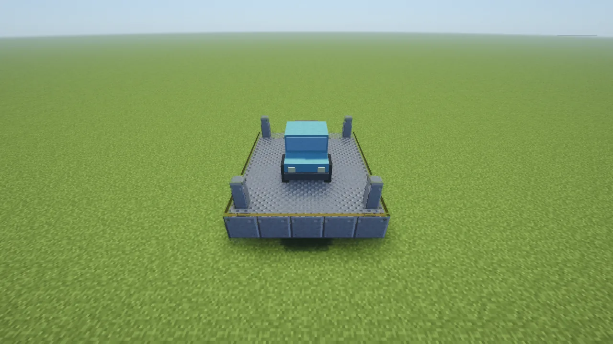

- **Placing:** the lift item lays the whole lift at once, a five-by-six deck with a post on
  each corner, facing you. It needs every cell clear and solid ground under the deck.
- **Using it:** right-click any block of it. There's a slot each for the chassis, the wheels,
  the engine and a dye.
  - **Build** puts the vehicle on the deck, facing the front, and uses exactly its parts.
  - **Paint** colours the vehicle standing on the deck with the dye, using one.
  - **Repair** appears while a damaged vehicle is on the deck: add the material it shows and
    press Repair. A full repair costs 20 steel for a Trailblazer, 18 iron for a Farmer's Pickup
    and 12 steel for a Trailer.
- Hover over a slot or a button to see what it's for. Closing the menu gives the parts back.
- Break any block of the lift and the whole lift comes back as one item.

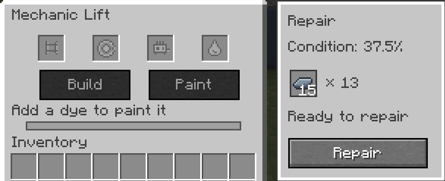

## Towing

- **Hitching:** hold a trailer item and right-click a vehicle with a free rear hitch: the
  trailer is put down already hitched. Or back your hitch up to a loose trailer's tongue and it
  catches with a clunk.
- **Unhitching:** crouch and right-click the tongue. The trailer rolls back a little, clear of
  the ball.
- A hitched trailer follows through turns like a real one. Trailers can tow trailers.

## Animals and other cargo

A trailer with room for cargo carries animals:

1. Crouch and right-click a **door** to open it (the same again shuts it).
2. Right-click the trailer **holding a lead, or with an empty hand**: every animal on your
   leads within ten blocks boards, nearest first, while there's room, and the leads come back to
   you. A young animal takes half the room of an adult.
3. To let them out, crouch and right-click the trailer **holding a lead** with the doors open.
   They step out behind.

Nothing boards through shut doors, and a full trailer says so. [Serfdom](/wiki/serfdom)'s
villagers in chains ride the same way.

## Rolling garage doors

Craft **eight Rolling Garage Door panels** from eight steel ingots around one redstone dust.

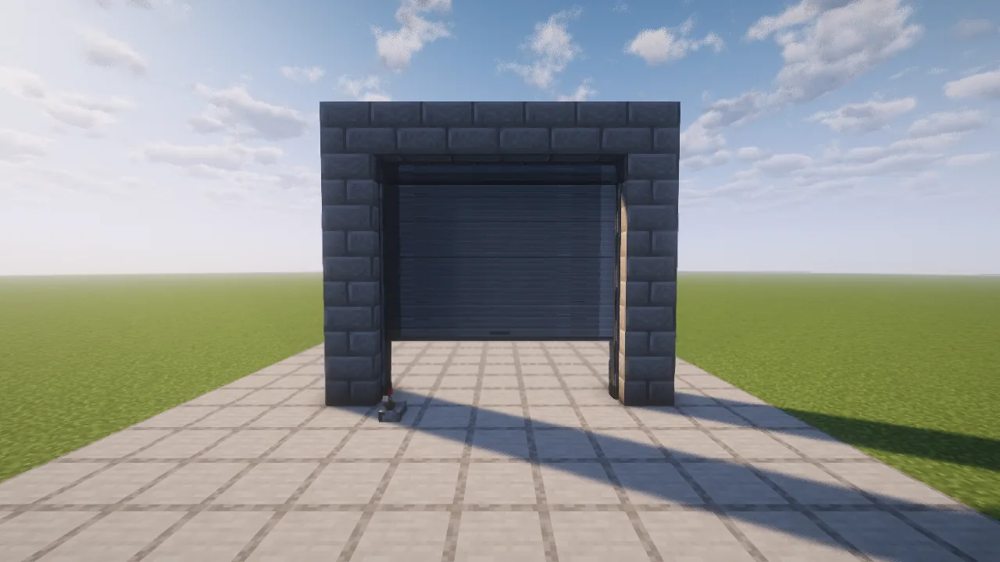

- **Building one:** place panels side by side and upward into a flat rectangle, up to 16 by 16.
  The first panel's outside faces you, and the rest follow it. Right-click a panel's edge to add
  the next one. Fill the whole opening.
- **Opening it:** redstone power opens it and no power closes it, so a lever beside it works.
  It won't close on a player, a mob or a vehicle in the opening.
- **Size it for the vehicle:** the roll at the top takes half a block of height and the side
  tracks a tenth of a block each side. A Trailblazer needs a door three blocks high; a Trailer
  or a Farmer's Pickup needs four.
- Vehicles drive straight through an open door, staying level.
- Breaking a section gives back one panel.

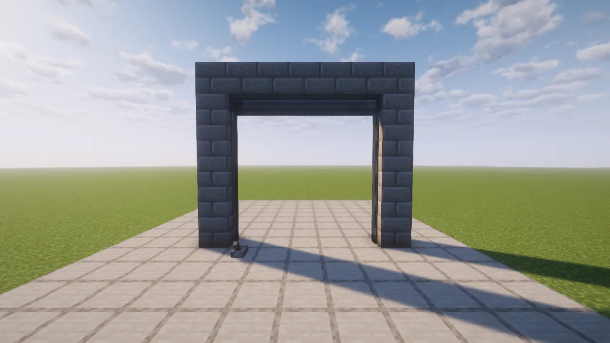
